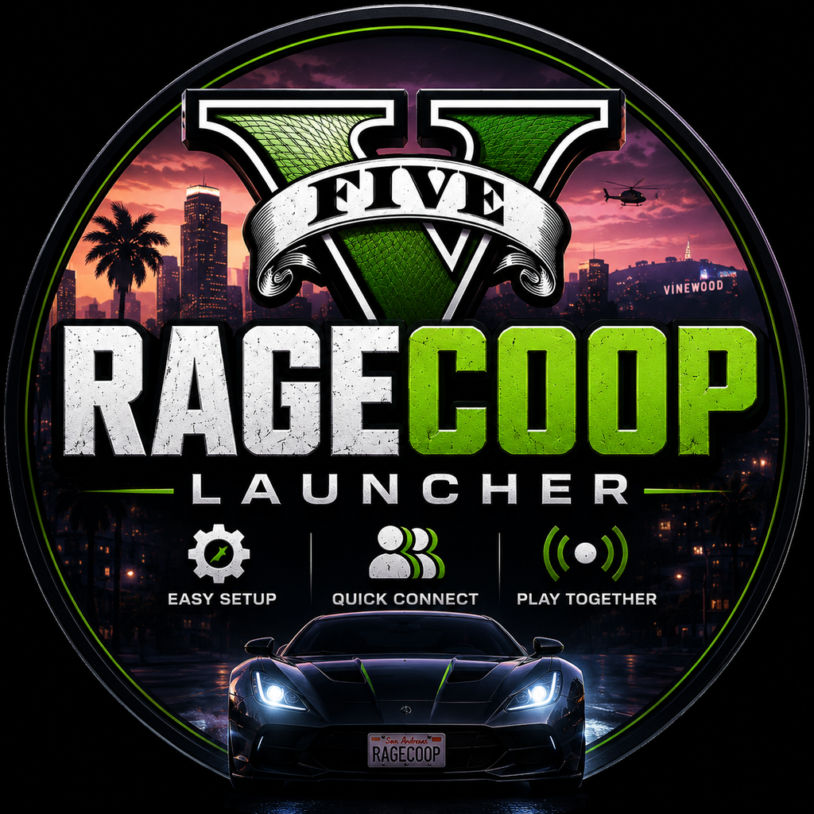

# GTA5 RAGECOOP Launcher



Простой Windows-лаунчер для GTA V RAGECOOP/RageCoop+: установить нужные файлы, выбрать способ связи, запустить сервер хоста и быстро подключить игрока.

Главная идея проекта: минимальный путь от установки до совместной игры. Хост запускает сервер и получает адрес для друга, игрок вставляет этот адрес, лаунчер сам пишет конфиг мода и запускает GTA V.

## Возможности

- Вкладка `Я Хост`: установка клиента мода в выбранную папку GTA V, запуск сервера, поиск адреса в активной VPN-сети, копирование адреса для друга.
- Вкладка `Я Игрок`: выбор папки GTA V, ввод адреса хоста, запись `LastServerAddress` в конфиг RageCoop/RageCoop+, запуск GTA V.
- Поддержка RageCoop+ для GTA V Enhanced.
- Windows setup через Inno Setup: меню Пуск, ярлык, uninstall и обновление поверх уже установленной версии.
- Встроенный выбор способа связи в установщике: ничего не ставить, WireGuard VPN или playit.gg tunnel.

## Какой VPN/tunnel выбрать

RAGECOOP использует UDP-порт `4499`, поэтому обычный `ngrok tcp` не подходит.

Доступные варианты:

- `WireGuard VPN`: подходит, если у вас уже есть один WireGuard/Amnezia сервер или конфиг, куда войдут оба игрока.
- `playit.gg tunnel`: подходит, если хост хочет сделать публичный UDP-туннель через playit. Хосту нужно настроить агент/туннель в playit, игроку VPN не нужен, он вводит адрес хоста из playit.
- `Ничего не устанавливать`: если вы уже используете ZeroTier, Tailscale, OpenVPN, AmneziaVPN или вручную пробросили UDP `4499`.

Хост и игрок должны использовать один и тот же сетевой сценарий: либо быть в одной VPN-сети, либо игрок подключается к публичному адресу туннеля/проброса хоста.

## Быстрый старт хоста

1. Установить `GTA5CoopSetup.exe`.
2. На странице `VPN / tunnel` выбрать нужный вариант.
3. Открыть `GTA5 RAGECOOP Launcher`.
4. Вкладка `Я Хост`.
5. Выбрать папку GTA V.
6. Нажать `Открыть VPN`, если выбран VPN-клиент.
7. Нажать `Запустить сервер` или `RageCoop+ server`.
8. Скопировать адрес, который показал launcher, и отправить другу.

## Быстрый старт игрока

1. Установить `GTA5CoopSetup.exe`.
2. Если выбран VPN-сценарий, открыть тот же VPN-клиент и войти в ту же сеть, что и хост.
3. Открыть `GTA5 RAGECOOP Launcher`.
4. Вкладка `Я Игрок`.
5. Выбрать папку GTA V.
6. Вставить адрес, который дал хост.
7. Нажать `Добавить кооператив и запустить GTA 5`.
8. В игре дождаться загрузки в одиночную игру.
9. Открыть меню RageCoop+. Обычно это `F12`; у обычного RAGECOOP может быть `F9`.

## Обновление

Новый `GTA5CoopSetup.exe` можно запускать поверх старой установки. Установщик использует тот же `AppId`, обновляет файлы программы и сохраняет пользовательский `launcher_config.json`, если он уже есть.

## Сборка из исходников

```powershell
python -m pip install -r requirements.txt
python -m PyInstaller GTA5CoopLauncher.spec --noconfirm
python -m PyInstaller GTA5CoopInstaller.spec --noconfirm --clean
.\build_windows_setup.ps1
```

Готовый Windows-установщик:

```text
dist\GTA5CoopSetup.exe
```

У каждого игрока должна быть своя установленная копия игры.

<!-- SANTIYA_SUPPORT_START -->
## Support / Поддержать проект

Cards / Карты:

- T-Bank card (RF only): `2200701933182781`
- Ozon Bank card (RF only): `2204320688009192`

Wallets / Кошельки:

- Solana: `97j3xnrjHtM5dDUZ8xAkAKqxY1Axro4gvsPCkqgZKQTj`
- Ethereum: `0x061dE20Bb9b2fA9c1C3d8E38939092aCB76284fe`
- Bitcoin: `bc1qfyzhnhajm8rslkhell9mg54na2tla90e6dkf3d`
<!-- SANTIYA_SUPPORT_END -->
